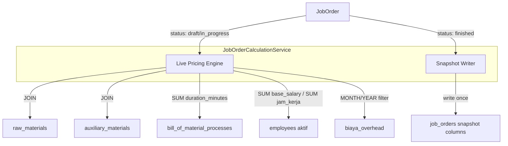

# Design: Job Order Calculation Revamp

## Overview

Fitur ini merombak logika kalkulasi HPP (Harga Pokok Produksi) pada Job Order agar konsisten, akurat, dan dapat diaudit. Ada lima area utama yang direvamp:

1. **Durasi dari BOM Process** — sumber tunggal durasi produksi
2. **Live Pricing BBB & Bahan Penolong** — harga selalu live dari master, di-snapshot saat `finished`
3. **Tarif BTKL Dinamis** — dihitung dari data aktual karyawan aktif
4. **Reset BOP Bulanan** — overhead hanya dari bulan berjalan
5. **Konsistensi HPP** — formula `total_hpp = total_bbb + total_btkl + total_bop` dengan snapshot

Semua perubahan bersifat backward-compatible: kolom yang ada tidak dihapus, hanya logika pengisian yang diubah.

---

## Architecture

Perubahan difokuskan pada layer **Service** dan **Controller**, dengan penambahan kolom snapshot di tabel `job_orders`. Tidak ada perubahan skema yang merusak.



### Komponen Utama

| Komponen | Tanggung Jawab |
|---|---|
| `JobOrderCalculationService` | Semua logika kalkulasi BBB, BTKL, BOP, HPP |
| `JobOrderController` | Delegasi ke service, tidak ada logika kalkulasi langsung |
| Migration | Tambah kolom snapshot di `job_orders` |

---

## Components and Interfaces

### JobOrderCalculationService

Service baru di `app/Services/JobOrderCalculationService.php`.

```php
interface JobOrderCalculationServiceInterface
{
    // Hitung durasi total dari BOM processes (SUM duration_minutes × quantity)
    public function calculateDuration(JobOrder $jobOrder): float; // dalam menit

    // Hitung total BBB dengan live pricing dari raw_materials
    public function calculateBBB(JobOrder $jobOrder): float;

    // Hitung tarif BTKL per jam dari employees aktif
    public function getBtklRatePerHour(): float;

    // Hitung total BTKL = durasi_jam × tarif_per_jam
    public function calculateBTKL(JobOrder $jobOrder): float;

    // Hitung total BOP dari biaya_overhead bulan berjalan + bahan penolong live
    public function calculateBOP(JobOrder $jobOrder): float;

    // Hitung total HPP = BBB + BTKL + BOP
    public function calculateHPP(JobOrder $jobOrder): float;

    // Snapshot semua nilai saat status berubah ke finished
    public function snapshotOnFinish(JobOrder $jobOrder): void;
}
```

### Integrasi Controller

`JobOrderController` diubah untuk mendelegasikan kalkulasi:

```php
// Sebelum (logika tersebar di controller):
$btkl = round($durasiJam * $tarifPerJam, 2);

// Sesudah (delegasi ke service):
$this->calculationService->calculateBTKL($jobOrder);
```

---

## Data Models

### Perubahan Tabel `job_orders`

Tambah kolom snapshot (nullable, hanya diisi saat `finished`):

```sql
ALTER TABLE job_orders
    ADD COLUMN snapshot_bbb        DECIMAL(15,2) NULL,
    ADD COLUMN snapshot_btkl       DECIMAL(15,2) NULL,
    ADD COLUMN snapshot_bop        DECIMAL(15,2) NULL,
    ADD COLUMN snapshot_hpp        DECIMAL(15,2) NULL,
    ADD COLUMN snapshot_btkl_rate  DECIMAL(10,4) NULL,  -- tarif per jam saat snapshot
    ADD COLUMN snapshot_at         TIMESTAMP     NULL;
```

Kolom `total_bbb`, `total_btkl`, `total_bop`, `total_hpp` yang sudah ada tetap digunakan sebagai nilai live (sebelum finished). Saat `finished`, nilai snapshot ditulis ke kolom `snapshot_*` dan kolom `total_*` dibekukan.

### Alur Data per Komponen

#### 1. Durasi (BOM Process)

```sql
-- Durasi per produk dalam job order
SELECT SUM(bmp.duration_minutes) * jod.quantity AS total_minutes
FROM bill_of_material_processes bmp
JOIN bill_of_materials bom ON bom.id = bmp.bill_of_material_id
JOIN job_order_details jod ON jod.product_id = bom.product_id
WHERE jod.job_order_id = :job_order_id
GROUP BY jod.id
```

#### 2. BBB Live Pricing

```sql
-- Harga selalu JOIN ke raw_materials (live)
SELECT jom.qty_total * rm.price_per_unit AS biaya
FROM job_order_materials jom
JOIN raw_materials rm ON rm.id = jom.bahan_baku_id
WHERE jom.job_order_id = :job_order_id
```

#### 3. Tarif BTKL Dinamis

```sql
-- Tarif per jam dari semua karyawan aktif
SELECT SUM(base_salary) / NULLIF(SUM(jam_kerja_per_bulan), 0) AS tarif_per_jam
FROM employees
WHERE status = 'active'
```

#### 4. BOP Bulanan

```sql
-- Hanya overhead bulan dan tahun berjalan
SELECT SUM(total) AS total_bop_bulan
FROM biaya_overhead
WHERE MONTH(periode) = MONTH(CURRENT_DATE)
  AND YEAR(periode)  = YEAR(CURRENT_DATE)
```

BOP per unit = `total_bop_bulan / total_unit_produksi_bulan_ini`

#### 5. Snapshot saat Finished

```php
// Dipanggil sekali saat status berubah ke 'finished'
$jobOrder->update([
    'snapshot_bbb'       => $this->calculateBBB($jobOrder),
    'snapshot_btkl'      => $this->calculateBTKL($jobOrder),
    'snapshot_bop'       => $this->calculateBOP($jobOrder),
    'snapshot_hpp'       => $this->calculateHPP($jobOrder),
    'snapshot_btkl_rate' => $this->getBtklRatePerHour(),
    'snapshot_at'        => now(),
    // Bekukan juga kolom total_* agar konsisten
    'total_bbb'          => $this->calculateBBB($jobOrder),
    'total_btkl'         => $this->calculateBTKL($jobOrder),
    'total_bop'          => $this->calculateBOP($jobOrder),
    'total_hpp'          => $this->calculateHPP($jobOrder),
]);
```

---

## Correctness Properties

*A property is a characteristic or behavior that should hold true across all valid executions of a system — essentially, a formal statement about what the system should do. Properties serve as the bridge between human-readable specifications and machine-verifiable correctness guarantees.*

### Property 1: Durasi selalu dari BOM Processes

*For any* Job Order dengan BOM yang memiliki satu atau lebih proses, total durasi yang dihitung oleh sistem harus sama dengan `SUM(duration_minutes × quantity)` dari `bill_of_material_processes` terkait. Mengubah `mulai_job_at` atau `selesai_job_at` tidak boleh mengubah nilai durasi.

**Validates: Requirements 1 (Sumber Durasi dari BOM Process)**

---

### Property 2: Live pricing BBB dan Bahan Penolong sebelum finished

*For any* Job Order dengan status selain `finished`, kalkulasi total BBB dan biaya bahan penolong harus selalu mencerminkan `price_per_unit` terkini dari tabel `raw_materials` dan `auxiliary_materials`. Jika harga di master diubah, kalkulasi ulang harus menghasilkan nilai yang berbeda sesuai harga baru.

**Validates: Requirements 2 (Live Pricing BBB & Bahan Penolong)**

---

### Property 3: Snapshot tidak berubah setelah finished

*For any* Job Order yang statusnya telah berubah ke `finished`, nilai `snapshot_bbb`, `snapshot_btkl`, `snapshot_bop`, dan `snapshot_hpp` tidak boleh berubah meskipun harga di `raw_materials`, `auxiliary_materials`, tarif karyawan, atau data `biaya_overhead` diubah setelahnya.

**Validates: Requirements 2 (snapshot saat finished), Requirements 5 (Konsistensi HPP)**

---

### Property 4: Tarif BTKL hanya dari karyawan aktif

*For any* set karyawan dalam sistem, tarif BTKL per jam harus sama dengan `SUM(base_salary) / SUM(jam_kerja_per_bulan)` dari karyawan dengan `status = 'active'` saja. Menambah atau mengubah karyawan dengan status non-aktif tidak boleh mengubah tarif yang dihitung.

**Validates: Requirements 3 (Tarif BTKL Dinamis)**

---

### Property 5: BOP hanya dari bulan dan tahun berjalan

*For any* kalkulasi BOP, total overhead yang digunakan harus sama dengan `SUM(total)` dari `biaya_overhead` di mana `MONTH(periode) = MONTH(CURRENT_DATE) AND YEAR(periode) = YEAR(CURRENT_DATE)`. Data overhead dari bulan atau tahun lain tidak boleh mempengaruhi hasil kalkulasi.

**Validates: Requirements 4 (Reset BOP Bulanan)**

---

### Property 6: Invariant HPP

*For any* Job Order, nilai `total_hpp` (atau `snapshot_hpp` jika sudah finished) harus selalu sama dengan `total_bbb + total_btkl + total_bop` (atau masing-masing snapshot-nya). Tidak boleh ada selisih akibat pembulatan yang tidak konsisten.

**Validates: Requirements 5 (Konsistensi HPP)**

---

## Error Handling

| Kondisi | Penanganan |
|---|---|
| Tidak ada karyawan aktif | `getBtklRatePerHour()` mengembalikan `0.0`, log warning |
| `SUM(jam_kerja_per_bulan) = 0` | Gunakan `NULLIF` di query, kembalikan `0.0` |
| Tidak ada `biaya_overhead` bulan ini | BOP dari overhead = `0.0`, tetap hitung bahan penolong |
| BOM tidak punya proses | Durasi = `0`, BTKL = `0` |
| Job Order sudah `finished` | `snapshotOnFinish()` idempoten — cek `snapshot_at IS NOT NULL` sebelum menulis |
| Harga material `NULL` atau `0` | Gunakan `0` sebagai fallback, log warning per item |

---

## Testing Strategy

### Unit Tests

Fokus pada contoh spesifik dan edge case:

- `JobOrderCalculationServiceTest`
  - Durasi = 0 jika BOM tidak punya proses
  - Tarif BTKL = 0 jika tidak ada karyawan aktif
  - `snapshotOnFinish()` idempoten (dipanggil dua kali tidak mengubah nilai)
  - HPP = BBB + BTKL + BOP untuk nilai konkret

### Property-Based Tests

Menggunakan library **[eris/eris](https://github.com/giorgiosironi/eris)** (PHP property-based testing).

Setiap property test dikonfigurasi minimum **100 iterasi**.

Setiap test diberi tag komentar dengan format:
`// Feature: job-order-calculation-revamp, Property {N}: {deskripsi singkat}`

**Property 1 — Durasi dari BOM:**
Generate BOM acak dengan N proses (duration_minutes acak), buat Job Order, panggil `calculateDuration()`, bandingkan dengan `SUM(duration_minutes × quantity)`.

**Property 2 — Live pricing:**
Generate Job Order non-finished, ubah `price_per_unit` di master, panggil `calculateBBB()`, pastikan hasilnya mencerminkan harga baru.

**Property 3 — Snapshot immutable:**
Generate Job Order, finish, ubah harga master, pastikan `snapshot_bbb/btkl/bop/hpp` tidak berubah.

**Property 4 — BTKL hanya karyawan aktif:**
Generate set karyawan campuran (aktif + non-aktif), pastikan `getBtklRatePerHour()` hanya menggunakan yang aktif.

**Property 5 — BOP bulan berjalan:**
Generate data `biaya_overhead` dari berbagai bulan, pastikan `calculateBOP()` hanya menjumlahkan bulan/tahun saat ini.

**Property 6 — Invariant HPP:**
Generate nilai BBB, BTKL, BOP acak, pastikan `calculateHPP()` selalu mengembalikan jumlah ketiganya tanpa selisih.
